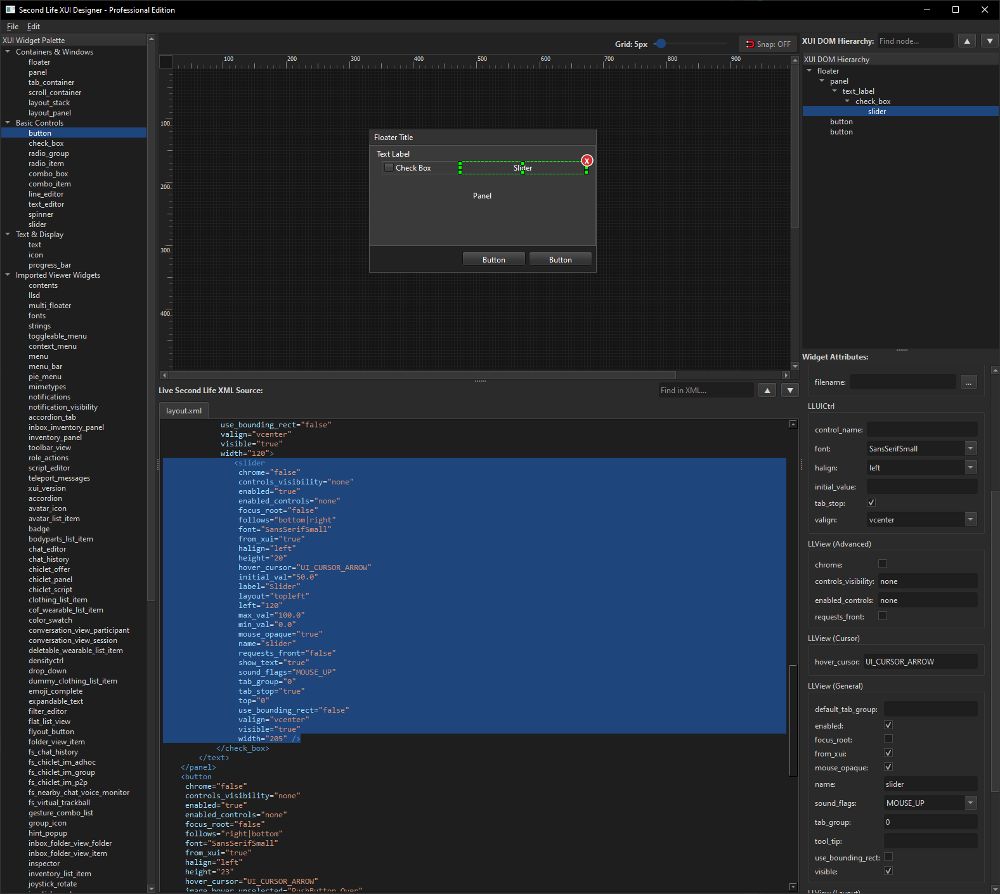
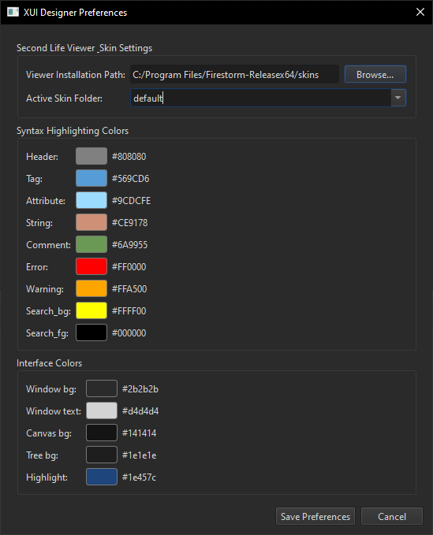

# XUIDesigner 
A Second Life XUI Layout Editor

XUIDesigner is a modern, high-performance desktop IDE built in Python and PySide6. It is designed specifically for creating, importing, editing, and compiling Second Life XML User Interface (XUI) layout structures. With live side-by-side visual designing and synchronized XML code generation, it takes the guesswork out of crafting interfaces for Second Life viewers.

---

## 📸 Screenshots

### Modern Dark-Mode Main Window

### Configuration & Theme Customization

---

## 🚀 Key Features

* **Visual Canvas with Interactive Alignment:** 
  * Drag-and-drop widget layout directly from a comprehensive, pre-registered XUI Widget Palette.
  * Real-time 8-way handles for resizing and snapping.
  * Dynamic grid-snapping slider (adjustable from `2px` to `50px`) with a quick hotkey toggle.
  * Precise 1:1 hardware ruler bars detailing active coordinate spaces.

* **Live Side-by-Side Synchronized XML Compiler:**
  * Changes on the canvas compile instantly to clean, compliant Second Life XML format.
  * Syntax highlighting featuring a robust, built-in XML scanner.
  * Bi-directional selection tracking: click a widget to jump straight to its code block, or search via the DOM Tree.

* **Advanced Tab and Layout Container Mechanics:**
  * Smart container support including `tab_container`, `layout_stack`, and `layout_panel`.
  * Create, delete, and switch active tab panels on-the-fly directly inside the canvas.
  * Automatic `follows` anchor layout recalculation (supporting nested layout constraints).

* **Multi-File & Skin Resource Importing:**
  * Recursively imports and merges secondary sub-XUI XML layout files (e.g., dynamically including headers, footers, or sub-panels).
  * Automatically searches relative working directories and systemic Second Life Skin configurations to resolve missing asset packages.
  * Supports custom skin theme parsing and custom 9-slice button/texture preview mapping.

---

### 🖥️ System & Runtime Requirements

* **Python 3.10+**: Built using modern performance features, including debounced background processing clocks and structural pattern definitions.
* **Operating System**: Seamlessly cross-platform, natively supporting **Windows 10/11**, **macOS**, and **Linux**.

---

### 📦 Core Library Dependencies & Hardware Drivers

The application relies on a pair of core library suites to orchestrate graphical presentation and asset processing:

* **Pillow (PIL)**: Manages image decoding and asset pipeline translation. It maps complex Second Life textures (such as high-resolution target `.tga` and `.j2c` arrays) into standard 32-bit pixel buffers (`Format_RGBA8888`).
* **PySide6 (Qt 6 bindings)**: Drives the IDE workspace. It utilizes the following underlying components:
  * **`QtWidgets`**: Architectures the dashboard workspace, orchestrating `QGraphicsView`/`QGraphicsScene` 2D visual layouts, multi-pane structural dock splitting (`QSplitter`), dynamic DOM context hierarchical navigation tree nodes (`QTreeWidget`), and side-by-side tabs (`QTabWidget`).
  * **`QtGui`**: Powers the 2D hardware graphics engines, deploying high-speed drawing brushes (`QPainter`, `QPen`, `QBrush`) to build application UI matrices and handle active texture caches (`QPixmap`, `QImage`).
  * **`QtCore`**: Routes thread signaling networks (`Signal`/`Slot`), processes hardware drop operations (`QMimeData`), and runs asynchronously debounced timers (`QTimer`) to prevent layout lag.
* **Standard Python Utility Libraries**:
  * `xml.etree.ElementTree`: Used directly to ingest, process, and output compliant layouts.
  * `os` & `sys`: Handles local and global system directories and configurations.

---

### 📂 Workspace Resource Specifications

The designer assumes you have secondlife viewer installed by default and will use the default skin path. you can select the skin directory for any other viewer and select the individual skins from the drop down.
* **Texture Paths & Viewer Skins (Optional)**: Access to active Second Life skin asset suites, enabling the application's engine to scan and apply custom button metrics and 9-slice textures live.